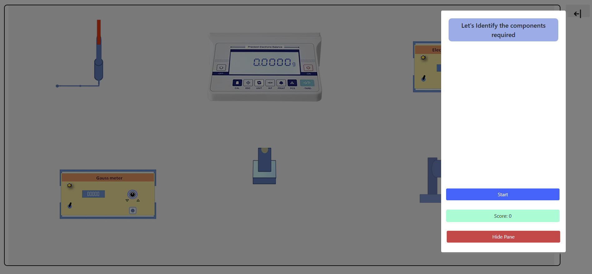
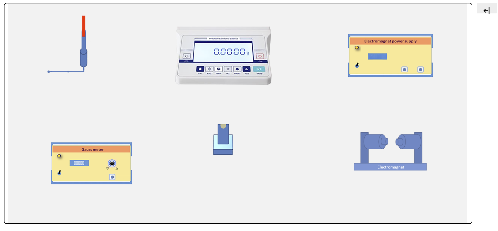
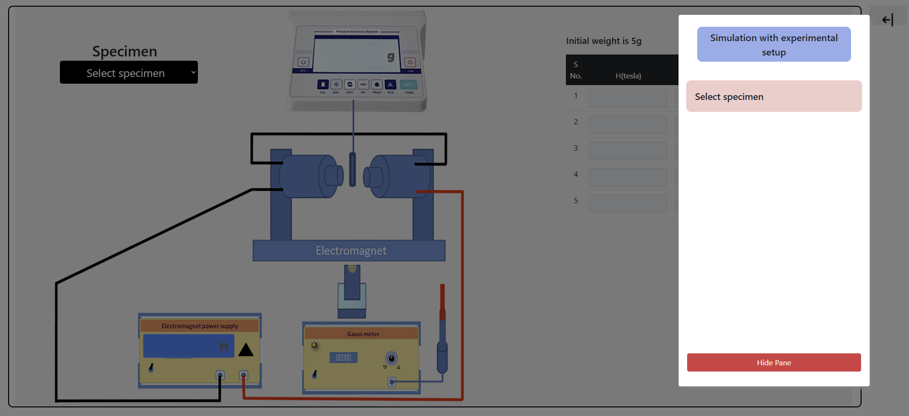
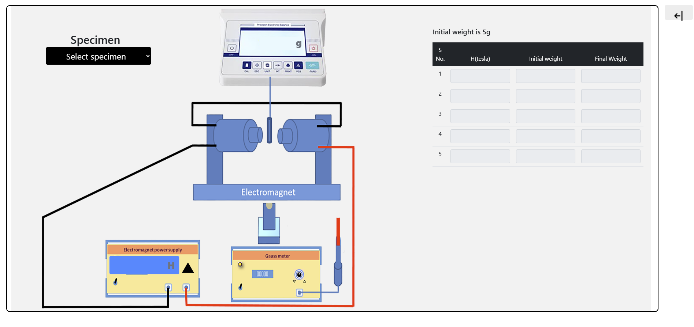
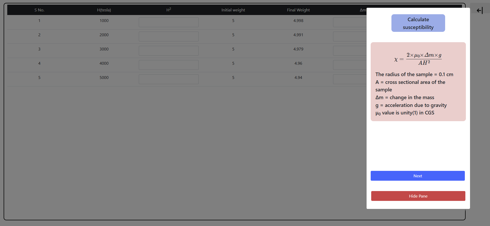
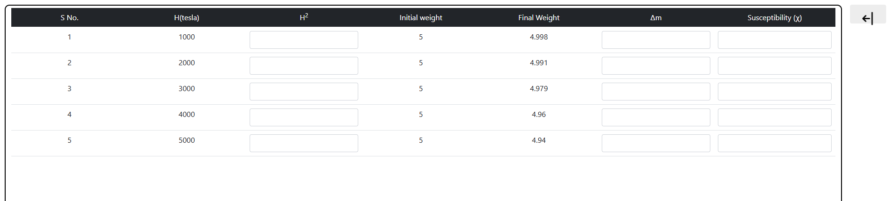
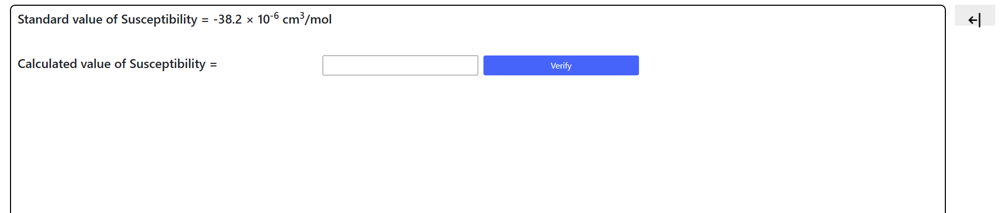

<h2>Procedure: </h2>
<ol>
    <li>Set up the Gouy balance with the electromagnet and analytical balance.</li>
    <li>Ensure that the balance is zeroed and calibrated properly.</li>
    <li>Measure the mass of the sample tube without the paramagnetic sample and record it.</li>
    <li>Fill the sample tube with the paramagnetic sample and place it in the magnetic field.</li>
    <li>Record the new mass reading.</li>
    <li>Calculate the change in mass (Δm) as the difference between the two readings.</li>
    <li>Note the field strength (H) provided by the electromagnet's specifications or measure it using a Gaussmeter.</li>
    <li>Use the formula provided to calculate the magnetic susceptibility, χm.</li>
</ol>

<h2>Calculations: </h2>

Substitute the values of Δm, g, μ₀, H, and l into the formula:
χm = (2 × Δm × g) / (μ₀ × H² × l)
to calculate the magnetic susceptibility.

<h2>Results: </h2>

The magnetic susceptibility (χm) of the given paramagnetic sample is found to be … (in appropriate units).

<h3>STEP 1:</h3>

Follow the instructions and identify the components.

<h3>STEP 2:</h3>

Follow the instructions and take all the required readings.

<h3>STEP 3:</h3>

Calculate the all the data.

<h3>STEP 4:</h3>

Verify the calculated susceptibility and calculate percentage error.

